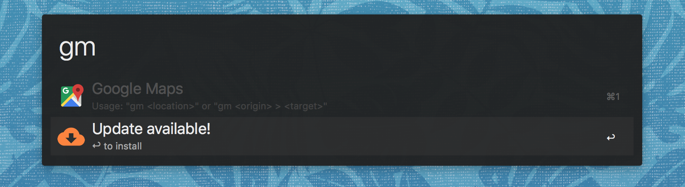

# Alfred Workflow for Google Maps

Quickly open Gooogle Maps searches or directions in your default browser.

## Usage

- **gm `<place>`**  
  Search for any place´
- **gm `<place>` > `<place>`**  
  Search for any directions
- **gm `<place>` > `<waypoint>` > `<place>`**  
  Search for any directions with waypoints

## Installation

- Download the `.alfredworkflow` file from the [latest version](https://github.com/josa42/alfred-google-maps/releases/download/0.1.0/google-maps-0.1.0.alfredworkflow)
- Double click `.alfredworkflow` file to install the workflow

## Update

If there is an update available, an option to update the extension will show up.

## License
[MIT © Josa Gesell](LICENSE)